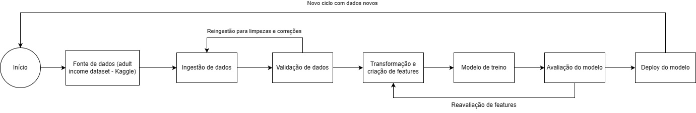

# Projeto de Ciência de Dados e Análise Preditiva - Predição de Renda (> US$50K)

## Alunos:
- Gustavo Dias
- Gustavo William Larsen

Repositório do trabalho final das disciplinas **Ciência de Dados** e **Análise Preditiva**, utilizando o dataset Adult ("Adult Income") para construir, comparar e disponibilizar um modelo de classificação que prevê se a renda anual de um indivíduo é maior que US$50.000.

---

## 1. Domínio do Problema, Pergunta de Negócio e Objetivo do Modelo

- **Domínio**: desigualdade de renda e análise socioeconômica de indivíduos, usando variáveis como idade, escolaridade, tipo de vínculo empregatício, ocupação, horas trabalhadas por semana e país de origem.
- **Pergunta de negócio**: *“Dado o perfil socioeconômico de um indivíduo, conseguimos prever se a sua renda anual será maior que US$50.000?”*.
- **Objetivo do modelo**: construir um **classificador binário** (renda >50K vs <=50K) capaz de apoiar decisões de negócio e políticas públicas, comparando diferentes algoritmos de classificação e escolhendo o melhor com base em métricas como **acurácia, precisão, recall e F1-score**.

Este escopo atende à **Parte 1** de Ciência de Dados (fundação do projeto) e ao item **a)** de Análise Preditiva (reapresentação do domínio de problema).

---

## 2. Arquitetura de Dados e Pipeline

- **Arquitetura escolhida**: **Data Lakehouse** (conceitualmente), permitindo armazenar dados brutos, realizar pré-processamentos e alimentar modelos de ML, combinando características de Data Lake e Data Warehouse.
- **Origem dos dados**: dataset **Adult Income** (UCI), disponibilizado localmente em `data/adult.csv`.

### Pipeline de dados (resumo)



1. **Ingestão**  
   - Leitura do arquivo `adult.csv` a partir da pasta `data/` usando `pandas`.
2. **Validação de Dados**  
   - Remoção de duplicatas.  
   - Tratamento simples de valores desconhecidos (como `?`, se necessário).  
   - Garantia de consistência de tipos e nomes de colunas.
   - Exploração de distribuições numéricas (`age`, `hours-per-week`, `capital-gain`, `capital-loss`, `educational-num`).
   - Análise de frequências de variáveis categóricas (`workclass`, `education`, `occupation`, etc.).
   - Investigação da relação entre `income` e variáveis como `education` e `hours-per-week`.
3. **Transformação e Criação de Features**  
   - Definição de `X` (features) e `y` (alvo binário: 0 = <=50K, 1 = >50K).  
   - Separação em treino e teste com `train_test_split` (20% teste, estratificado em `income`).  
   - Pré-processamento com `ColumnTransformer`:
     - `StandardScaler` para colunas numéricas.
     - `OneHotEncoder` para colunas categóricas.
4. **Modelo de Treino**
   - Criação de um pipeline de modelagem que integra pré-processamento e algoritmos de Regressão Logística, Árvore de Decisão e Random Forest).
   - Ajuste dos parâmetros do modelo usando apenas os dados de treino.
5. **Avaliação do Modelo**
   - Avaliação do desempenho do modelo no conjunto de teste utilizando métricas como acurácia, precisão e recall.
   - Inspeção da matriz de confusão para verificar padrões de erros.
6. **Deploy do Modelo**
   - Exportação do modelo treinado usando pickle (.pkl).

Este pipeline atende à **Parte 2** de Ciência de Dados (jornada dos dados) e ao item **b)** de Análise Preditiva (pipeline a partir do repositório).

---

## 3. Modelagem e Avaliação Comparativa

Toda a modelagem está detalhada em `notebooks/02_modelagem_comparativa.ipynb`.

### Modelos utilizados

- Regressão Logística  
- Árvore de Decisão  
- Random Forest  

Cada modelo é implementado como um **Pipeline do scikit-learn**, combinando:
- Pré-processamento (`ColumnTransformer` com `StandardScaler` + `OneHotEncoder`), e  
- Algoritmo de classificação (LogisticRegression, DecisionTreeClassifier, RandomForestClassifier).

### Métricas de avaliação

- **Acurácia**  
- **Precisão (Precision)**  
- **Recall (Sensibilidade)**  
- **F1-Score**  

As métricas são calculadas em **treino** e **teste**, gerando uma **tabela comparativa** com as colunas:
- `Acuracia_treino`, `Precisao_treino`, `Recall_treino`, `F1_treino`  
- `Acuracia_teste`, `Precisao_teste`, `Recall_teste`, `F1_teste`

Também é exibida a **matriz de confusão** do melhor modelo (com base em F1 no teste).

### Escolha do modelo final

O modelo final é escolhido com base no **F1-Score no conjunto de teste**, por equilibrar Precisão e Recall em um cenário com desbalanceamento entre classes. A análise leva em conta:
- desempenho geral nas métricas;
- diferença entre treino e teste (para evitar overfitting);
- coerência com o objetivo de negócio (equilíbrio entre identificar indivíduos de alta renda e limitar falsos positivos).

Esta parte cobre a **Parte 3** de Ciência de Dados e o item **c)** de Análise Preditiva.

---

## 4. Deploy do Modelo (modelo_final.pkl)

Após escolhida a melhor combinação **pré-processamento + modelo**, o pipeline treinado é salvo em `modelo_final.pkl` usando `joblib`.  
O notebook `notebooks/03_deploy_exemplo.ipynb` demonstra:

- Como **carregar** o modelo salvo (`joblib.load('modelo_final.pkl')`);  
- Como montar um `DataFrame` com **novos indivíduos** (mesmas colunas de entrada usadas no treino);  
- Como obter:
  - a **classe prevista** (0 = <=50K, 1 = >50K);  
  - a **probabilidade** estimada de renda >50K;  
- Como interpretar os resultados em termos de negócio.

Esta etapa atende à **Parte 4** de Ciência de Dados e ao item **d)** de Análise Preditiva (deploy do modelo).

---

## 5. Estrutura do Repositório

- `README.md` — relatório principal do projeto, conectando requisitos das duas disciplinas.
- `README.negocio.md` — texto detalhado de domínio, pergunta de negócio e objetivo.
- `pipeline.jpeg` — diagrama visual do pipeline de dados e machine learning.
- `data/`
  - `adult.csv` — dataset utilizado no projeto.
- `notebooks/`
  - `01_eda_adult.ipynb` — análise exploratória e seleção de features.
  - `02_modelagem_comparativa.ipynb` — construção, avaliação e comparação dos modelos.
  - `03_deploy_exemplo.ipynb` — exemplo de deploy e uso do modelo salvo.
- `scripts/`
  - `data_pipeline.py` — funções auxiliares de carregamento e preparação básica dos dados.
- `requirements.txt` — dependências do projeto (pandas, numpy, scikit-learn, matplotlib, seaborn, joblib).
- `modelo_final.pkl` — arquivo do modelo salvo (a ser gerado ao rodar a modelagem).

---

## 6. Como Reproduzir o Projeto

1. **Clonar o repositório**  
   ```bash
   git clone https://github.com/guusdias/gain-prediction
   cd gain-prediction
   ```
2. **Criar e ativar um ambiente virtual (opcional, recomendado)**  
   ```bash
   python -m venv .venv
   source .venv/bin/activate  # Linux/Mac
   # ou
   .venv\\Scripts\\activate   # Windows
   ```
3. **Instalar dependências**  
   ```bash
   pip install -r requirements.txt
   ```
4. **Garantir presença do dataset**  
   - Verificar se `data/adult.csv` existe.  
   - Caso não exista, baixar o dataset Adult (Adult Income) e salvar com esse nome e localização.
5. **Executar os notebooks na ordem**  
   - `notebooks/01_eda_adult.ipynb`  
   - `notebooks/02_modelagem_comparativa.ipynb` (gera/atualiza `modelo_final.pkl`)  
   - `notebooks/03_deploy_exemplo.ipynb` (usa `modelo_final.pkl` para prever novos casos).

---

## 7. Mapeamento para os Critérios de Avaliação

- **Ciência de Dados**
  - Parte 1 — Problema de Negócio: seções 1 e `README.negocio.md`.
  - Parte 2 — Pipeline e Arquitetura: seção 2 e `scripts/data_pipeline.py`, `01_eda_adult.ipynb`.
  - Parte 3 — Modelagem: seção 3 e `02_modelagem_comparativa.ipynb`.
  - Parte 4 — Deploy: seção 4 e `03_deploy_exemplo.ipynb`, `modelo_final.pkl`.
- **Análise Preditiva**
  - a) Domínio: seção 1 / `README.negocio.md`.
  - b) Pipeline: seção 2 / `scripts/data_pipeline.py` / `01_eda_adult.ipynb`.
  - c) Treinamento e métricas de 3 modelos: seção 3 / `02_modelagem_comparativa.ipynb`.
  - d) Deploy do modelo: seção 4 / `03_deploy_exemplo.ipynb` / `modelo_final.pkl`.
